---
lab:
    title: '[Lab 01] Setting the environment'
    module: ' Power Automate'
---
# LAB 1 - Setting the environment

Prerequisite: Required software on your computer
--------------------------------------------------------

The requirements for this lab are as follows:

*   Microsoft Power Automate for each user with attended Robotic Process Automation (RPA) plan trial
    
*   Microsoft Power Apps Developer Plan
    
*   Microsoft Exchange mailbox

Introduction
------------
This lab guides you through the following steps:

*   Install the Power Automate for desktop app and the required extensions.
    
*   Register your machine.
    
*   Install the Contoso Invoice app.
    

>:information_source:**Note**
>
>If you've previously installed the legacy V1 UI flows exe or SoftoMotive RPA software, we recommend that you uninstall/remove all browser >extensions from your browser first (such as Chrome, Edge, or Firefox).

>:information_source:**Note**
>To complete the labs, you'll need to use a few files. Download the [Lab files](https://github.com/nephoseu/LGPowerAutomate/raw/main/LabData.zip) for use in this lab. Extract the contents of this download to your local computer.
----
Task 0:
-------------------
Get Power Apps Developer Plan
=============================

<mark> **Skip this task if you already have a Power Apps trial environment.**  </mark>

1.  Go to [https://make.powerapps.com/](https://make.powerapps.com/?azure-portal=true) and make sure that you're signed in.
    
2.  Go to [Power Apps Developer Plan](https://powerapps.microsoft.com/developerplan/?azure-portal=true) and select **Existing user? Add a dev environment**.
    
    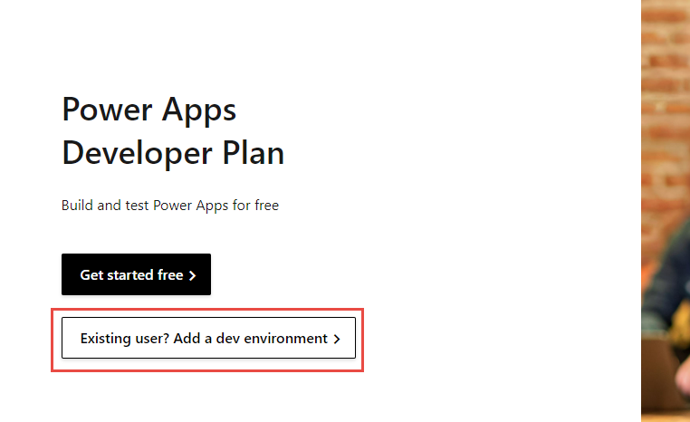
    
3.  Select your region and then select **Accept**.
    
    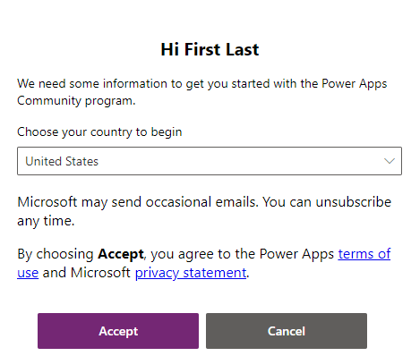
    
4.  You'll be redirected to the maker portal. Wait a few minutes for the environment setup to complete.
    
5.  Select the environment name. The new dev environment should display. Select the dev environment.
    
    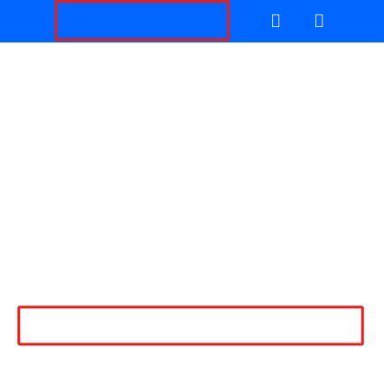
----   

Task 1:
-------
Install the Power Automate for desktop application
==================================================

Your next task is to install the Power Automate for desktop app.

1.  Go to [https://powerautomate.microsoft.com/](https://powerautomate.microsoft.com/?azure-portal=true) and sign in with the account that you're using for the labs.
    
2.  Select **My flows** from the left menu.
    
    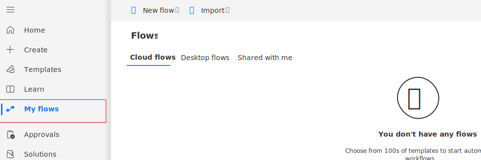
    
3.  Select the **Install** dropdown menu to the right of the screen and then select **Power Automate for desktop**.
    
    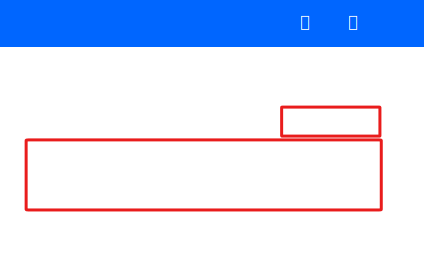
    
   > :information_source:**Note**
   > Pay attention to the bar at the bottom of your browser where it shows the downloading progress.
    
4.  After the download completes, select the .exe file to open and run the installer: Setup.Microsoft.PowerAutomate.exe
    
    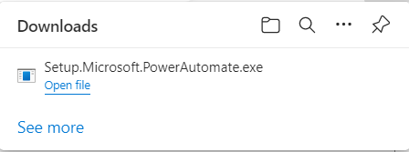
    
5.  Within the **Install Power Automate package** dialog, select the **Next** button.
    
    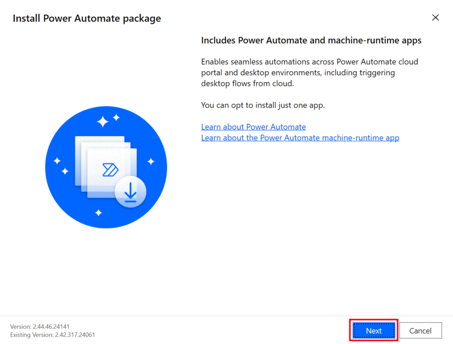
    
6.  Select the checkboxes to agree to Microsoft's terms of use and installing both Power Automate for desktop and the machine-runtime app and then select the **Install** button.
    
    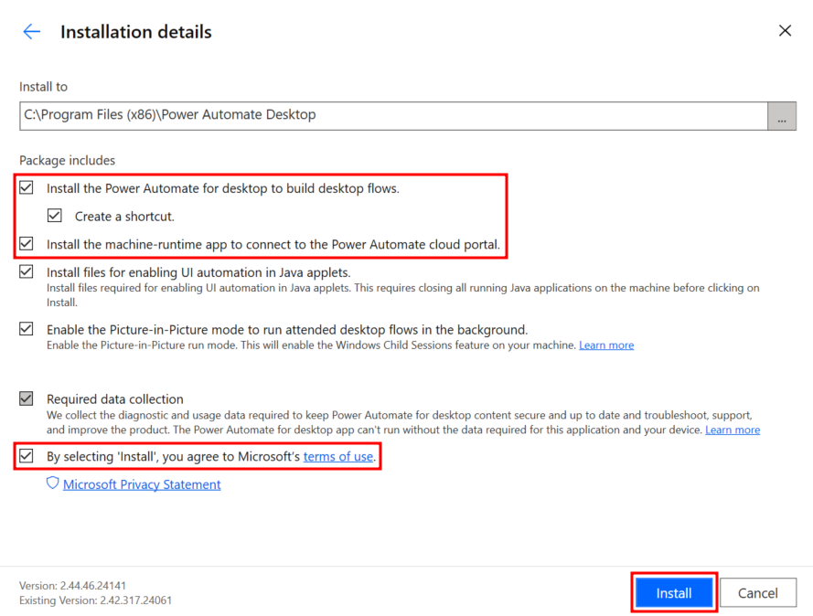
    
   > :information_source:**Note**
   > If you're asked about allowing this app to make changes to your computer, select **Yes**.
    
7.  The installer installs the following components on your computer:
    
    *   Power Automate for desktop app
        
    *   Power Automate for desktop browser extension for Microsoft Edge Chromium and Google Chrome
        
    *   Power Automate machine-runtime management app
        
8.  After the installation is finished, select the **hyperlinks** in step 1 within the **Installation successful** dialog to navigate to a chosen browser(s) to enable Power Automate for desktop extensions. After your extensions are set up, you can launch Power Automate for desktop in step 2 within the **Installation successful** dialog.
    
    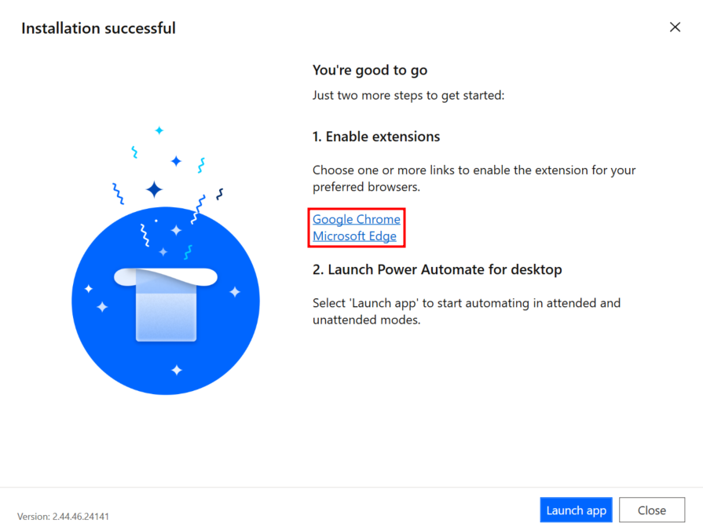
    
9.  If the prompt doesn't appear, you can still manually enable the extension. Depending on what browser you're using, follow these steps to confirm that the extension is enabled.
    
    *   Enable in Microsoft Edge (Chromium).
        
        *   Open edge://extensions URL in the Microsoft Edge (Chromium) browser.
            
        *   Find the **Microsoft Power Automate** extension.
            
        *   Switch the toggle to **enable extension**.
            
        
        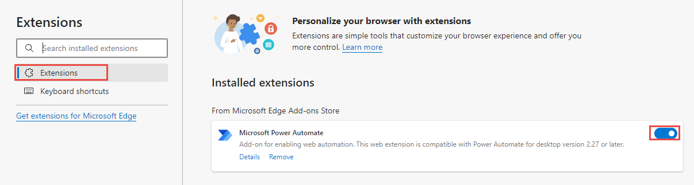
        
        *   Select **Details**.
        
        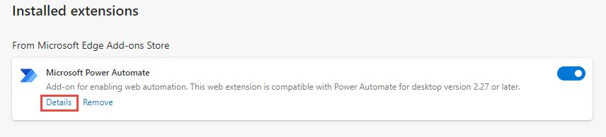
        
    *   Select the **Allow in InPrivate** checkbox.
        
        
        
    *   Enable in Google Chrome.
        
        *   Open chrome://extensions URL in the Chrome browser.
            
        *   Find the **Microsoft Power Automate** extension.
            
        *   Switch the toggle to **enable extension**.
            
        
        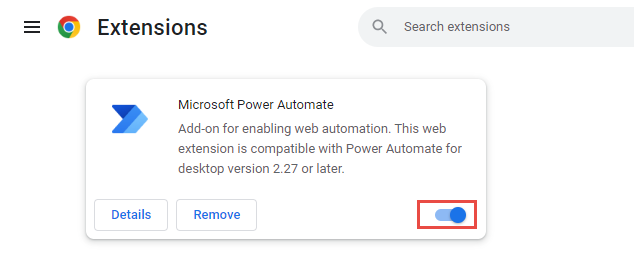
        
        *   Select **Details**.
            
        *   Switch the toggle for **Allow in Incognito** to be on.
            
        
        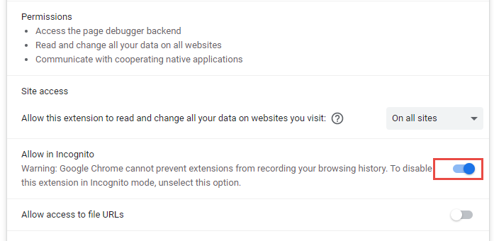
        
10.  Launch **Microsoft Power Automate** on your desktop. In the opened window, select **Sign in** and enter the account details of the account you're using for the labs.
    
    
11.  Select your region and then select **Get started**.
    
12.  Select **Go premium** if you don't already have Power Automate Premium.
    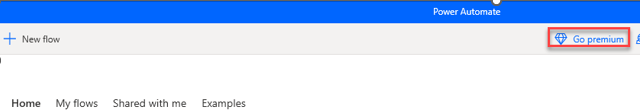
13.  Select **Start trial**.

----

Task 2:
-------
Register your machine
=====================

>:information_source:**Note**
>
>If you haven't previously registered your machine to another environment, Power Automate Desktop will automatically register your machine to the default environment at installing time, so you don't need to do the following steps manually. However, we still recommend that you try to follow the subsequent steps.

To register your machine, follow these steps:

1.  Search for **Power Automate machine runtime** from the Windows search bar in the lower part of your desktop.
    
2.  Select the **Power Automate machine runtime** app.
    
    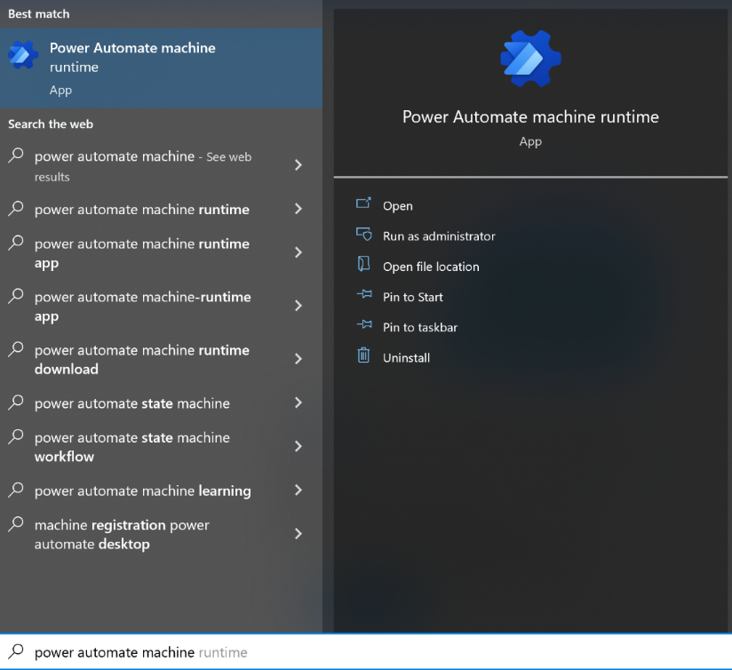
    
3.  The **Power Automate machine runtime** app opens. **Sign in** if prompted.
    
    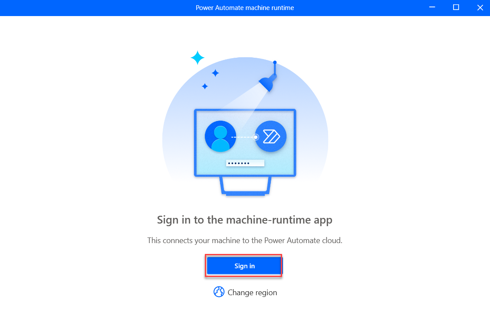
    
4.  Select the dev environment that you created.
    
    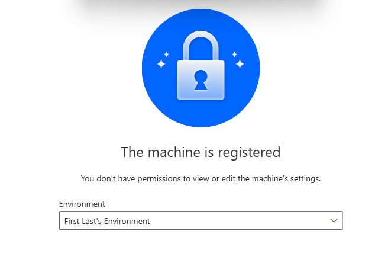
    
5.  You can select the **Register machine** button to register your machine to the default environment. If you have multiple environments and want to register your machine to a different environment than the default one, you can use the **Environment** dropdown menu to select the desired environment and then select **Register**.
    
>:information_source:**Note**
>Power Automate will only allow the cloud flows in the registered environment to trigger desktop flows to run on your machine.
    
>:information_source:**Note**
>If your environment does not register properly, select the **Learn More** button within the notification ribbon that appears at the top of the window. Follow the steps within to then ensure that you can now register your machine to the desired environment.
    
6.  After you register successfully, information displays in the machine runtime app, as shown in the following screenshot.
    
    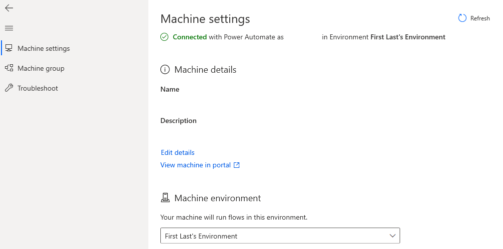
    
7.  In the future, you can also use the **Machine group** settings to add more machines to one machine group and then manage them together. For more information, see [Manage machine groups](/en-us/power-automate/desktop-flows/manage-machine-groups/?azure-portal=true).
    
8.  Close the Power Automate machine runtime application.
    

>:information_source:**Note**
>Users will need an Environment Maker or desktop Flow Machine Owner role permission to register machines. Before registering a machine, make sure that you have the required permissions and that an available environment is present for you to register the new machine in.

Task 3:
-------
Install the Coffee Shop Contoso invoice app (for lab scenario use)
==================================================================

This lab uses a coffee shop company business scenario to demonstrate how to automate manual invoice processing steps by using Power Automate desktop flow and cloud flows. This coffee shop company uses a Win32 application to manually manage their invoice system. Your first task is to download and install this application to prepare for the lab.

1.  Download [**ContosoInvoicingSetup.exe** and **ContosoInvoicingSetup.msi**](https://aka.ms/AutomationIADStudent) from the **Prerequisite Lab #1 Install Contoso Coffee Shop Invoicing management app** folder from the downloaded files. Double-click the .exe file to install the **ContosoInvoicingSetup** application.
    
>**Note**
>You'll need to select **More Information** and **Run it anyway** during the installation of the Contoso app _if_ Windows Defender prompts that the app is coming from an untrusted source.
    
2.  After the installation is fully complete, launch the **Contoso Invoicing app** from the **Start** menu by using the search bar in the lower part of your Windows desktop. Within the search bar, type **Contoso Invoicing**.
    
3.  Right-click the app icon located in the lower task bar of your desktop and then select the option to **pin** the app icon to the **task bar** for quick launch. You use this app in subsequent labs, for the Process advisor and the robotic processing automation recordings.
    
    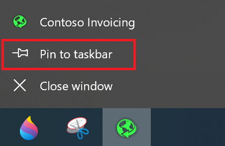
    
    Next, spend some time getting familiar with the Contoso Invoicing app. These steps explore how the Contoso Coffee shop employee manually enters a new invoice record into the company application system when a new invoice is received. This lab helps you better prepare for the following labs.
    
4.  With the **Contoso Invoicing App** open, select **Invoices** from the left pane.
    
    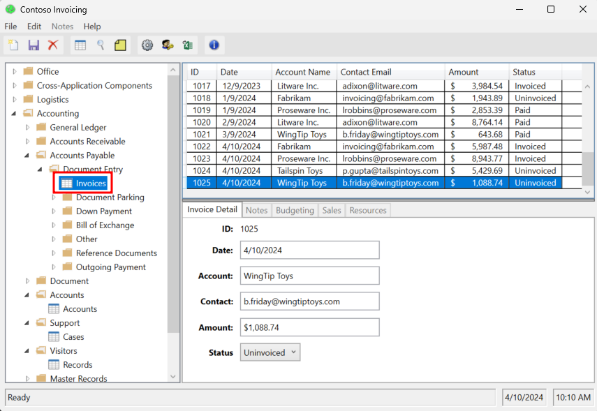
    
5.  Select the **New record** icon from the ribbon in the upper-left corner of the screen to create a new invoice.
    
    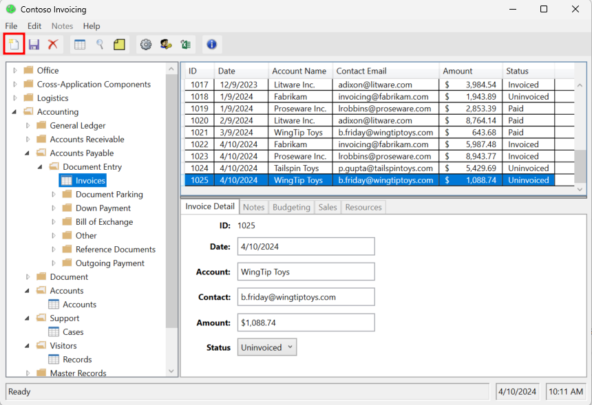
    
6.  You can fill in any information for the new invoice in the text boxes that appear in the center of the screen. For this example, enter the following information:
    
    *   **Date** - (Current date)
        
    *   **Account** - Admin Account
        
    *   **Contact** - (Email that you used to sign in to the accounts)
        
    *   **Amount** - $100.00
        
    *   **Status** - Paid
        
    
    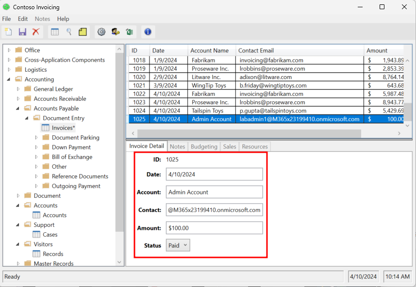
    
7.  Select the **Save** icon from the ribbon in the upper-left corner of the screen to save your new invoice.
    
    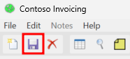

-------
## Congratulations!

You've now gone through the steps of installing required software on your computer for the Power Automate for desktop app and required extensions, registering the machine, and installing the Contoso Invoice app.

    
