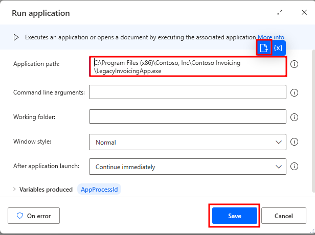
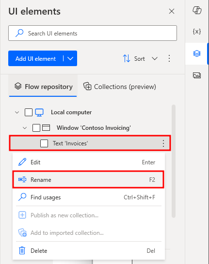
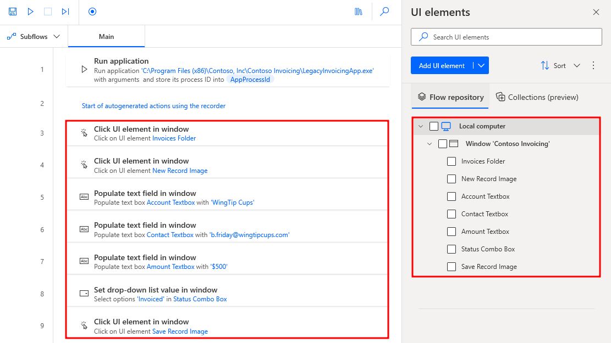
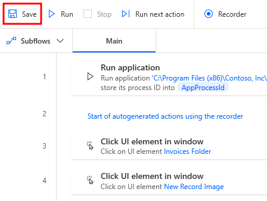

---
lab:
    title: '[Lab 02] Create a desktop flow'
    module: 'Power Automate'
---
# LAB 2 - Create a desktop flow

    
Prerequisites
-------------

This lab builds on the initial setup lab (**Lab 1 - Setting the environment**). Ensure that you've completed all tasks.

>:warning:Important
>Because you'll be recording actions that are performed in your UI in this lab, we recommend that you view the lab instructions on a separate device or in a printout. You can still complete the lab while using the instructions during UI action recording, but you'll need to perform extra work to cut the recorded actions of viewing the instructions from the desktop flow.

Also, make sure that you review the [known operating system requirements and limitations for desktop flows](/en-us/power-automate/desktop-flows/requirements/?azure-portal=true).

Introduction
============

Now you're ready to use Microsoft Power Automate desktop flows to start automating some processes to help increase productivity and efficiency. You'll complete the following tasks in this lab:

*   Get familiar with Power Automate desktop flows.
    
*   Create a new solution.
    
*   Create a new desktop flow.
    
*   Record actions that are performed in the desktop-installed Contoso Invoicing application.
    
*   Perform a test run of the new desktop flow.

About solutions
---------------

This lab introduces the concept of solutions. Developers use solutions to write, package, and maintain units of software that extend Microsoft Dataverse. For example, developers would deploy the Microsoft Dynamics 365 Sales, Microsoft Dynamics 365 Customer Insights - Journeys, and Microsoft Dynamics 365 Customer Service apps by using solutions. Customizers and developers distribute software through solutions so that organizations can use Microsoft Dataverse to install and uninstall the business functionality that the solution defines. For more information, see [Introduction to solutions](/en-us/powerapps/developer/common-data-service/introduction-solutions/?azure-portal=true).

>:information_source:**Note**
>To complete the labs, you'll need to use files downloaded in the previous lab.

Task 1: Get familiar with Power Automate for desktop
==============================================================

>:information_source:**Note**
>Make sure that you complete **Lab 1: Setting the environment**.

To get more familiar with the Power Automate for desktop app, follow these steps.

1.  Launch the Power Automate for desktop app from your computer and then sign in to your account.
    
    
    
2.  Select the **Environments** dropdown menu in the upper part of the page to change your environment to the appropriate one.
    
    
    
3.  Select the **\+ New flow** button in the upper-left corner of the page to create a new Power Automate desktop flow.
    
    
    
4.  Within the **Build a flow** dialog, in the **Flow name** field, name the new flow `testing`. Then, in the lower-right corner of the dialog, select **Create**.
    
    
    
5.  A tour dialog appears if it's your first time signing in. You can choose to continue the tour or to skip it.
    
    
    
    Next, you're directed to the Power Automate for desktop designer, which consists of the following toolbars and panes:
    
    *   **A: Toolbar** - Contains basic operations for use with actions (**Save**, **Undo**, **Copy**, **Debug**, and **Paste**) and the **Recorder** option to start the recording and to control the process implementation (**Start**/**Pause**/**Stop**).
        
    *   **B: Subflows** - Allows you to create subflows under your main flow.
        
    *   **C: Actions pane** - Contains all Power Automate for desktop actions and includes a search bar that helps you find specific actions by matching the action name to the text string.
        
    *   **D: Workspace** - Contains all actions added to the process so far. Functions are separated into tabs.
        
    *   **E: Copilot in Power Automate for Desktop** - Contains Copilot prompt and response area for Power Automate for Desktop.
        
    
    
    
6.  From the tool bar in the upper part of the screen, select **Save**.
    
    
    
7.  **Close** out of the testing flow that you created.
    
8.  Select the ellipsis (**...**) menu to the right of the flow and then select **Delete** to delete the testing desktop flow.
    
    
    
9.  Select **Yes** to confirm the deletion.
    
10.  **Close** out of the Power Automate application.

Task 2: Create your first Power Automate desktop flow
========================================================

>:information_source:**Note**
>You'll need to select **More Information** and **Run it anyway** during installation of the Contoso app if Windows Defender prompts that the app is coming from an untrusted source.

Now that you're more familiar with the Power Automate for desktop app, you can create a desktop flow that helps Contoso Coffee shop employees enter invoice information into the desktop management system. In the previous task, you learned how to create a desktop flow from within the Power Automate for desktop app. Now, you learn about another path for creating and managing desktop flows from the browser side.

1.  Open a new web browser and then go to [https://powerautomate.microsoft.com](https://powerautomate.microsoft.com/?azure-portal=true). Sign in with your test account, the same one that you used in the previous labs.
    
   >:information_source:**Note**
   >For this workshop, don't use the **Flows** tab from powerapps.com.
    
2.  If you're signing in to this site for the first time, you need to choose your country/region, and then select the **Get started** button.
    
    
    
    >>:information_source:**Note**
    >>Make sure that you've selected the correct environment (with database) to use for the labs. You can switch between different environments by selecting the **Environments** button in the title bar.
    
    
    
3.  Select **Solutions** from the left menu and then select the **\+ New solution** option in the upper part of the screen.
    
    
    
4.  Name the new solution as `Invoice processing solution <MyUserName>`. Select **CDS Default Publisher** from the **Publisher** dropdown menu and then select **Create**.
    
    
    
    >>:information_source:**Note**
    >>When selecting the Publisher, the correct option always begins with **"CDS Default Publisher"**, but the numbers and letters within the parenthesis directly after may vary.
    
    >>:information_source:**Note**
    >>For the purposes of this lab, using **CDS Default Publisher** is acceptable. For production scenarios, we recommend that you create your own custom publisher. For more information, see [Solution publisher](/en-us/power-platform/alm/solution-concepts-alm?azure-portal=true#solution-publisher).
    
5.  Wait for the solution to be created. You should automatically be taken to the solution that you created when it finishes.
    
6.  At the top of the screen, select the **\+ New** dropdown menu.
    
7.  From the **\+ New** dropdown menu, select **Automation > Desktop flow**.
    
    
    
8.  In the **Build a desktop flow** dialog, in the **Flow name** box, name the new flow as `Enter an invoice`. Then, select the **Launch app** button in the lower right of the dialog.
    
    
    
9.  If you're presented with a dialog that wants to open Power Automate, select the **Always allow** checkbox and then select **Open Power Automate** to open the Power Automate for desktop app.
    
    
    
10.  When you're in the Power Automate for desktop app designer, in the **search bar** in the **Actions** pane, enter `run application` and then double-click the **Run application** action.

    
11.  Within the **Run application** dialog, for the application path parameter, go to and select the location path of the **Contoso Invoicing app** under **Application path**. (This action opens the Contoso Invoicing app when you're running your flow). Usually, you can find this parameter under `C:\Program Files (x86)\Contoso, Inc\Contoso Invoicing\LegacyInvoicingApp.exe`; however, the path might be different on your computer.
    
12.  Select the **Save** button in the lower-right corner of the dialog.
    

    
13.  Now you have one action in your flow that opens the Contoso Invoicing app. You can select the **Run** button to quickly test your flow.
    

    
14.  Minimize the Contoso Invoicing app manually and then select **Recorder**.
    

    
>:green_book:Tip   
>Now, you can start recording. We recommend that you get familiar with the following steps until the recording is done. As a result, you can finish the recording in one instance without manually going back and forth. If your first few recordings aren't acceptable, you can delete the recording afterward by selecting the ellipsis (**...**) menu and then practice more until you have an acceptable recording.
    
>:green_book:Tip   
>To help with the resilience of UI automation playbacks, we recommend that you minimize other apps from your desktop.
    
15.  Reopen the Contoso Invoicing app and then select the **Record** button from the **Recorder** dialog.
    

    
16.  In the Contoso Invoicing application, select **Invoices** from the left menu.
    
>:green_book:Tip  
>As your mouse cursor hovers over controls in the app, a red outline will highlight each control. Don't record at fast speed and always wait between each mouse move. Wait until a blue highlight rectangle appears around the control first before you select the control. If the red highlight doesn't appear before you select, the action might not record properly.
    

    
17.  Create a new record by selecting the **New record** icon from the ribbon in the upper left of the screen.
    

    
18.  Use these sample values to complete the recording (you can also use any arbitrary values):
    
*   **Date** - Current date
    
*   **Account** - `WingTip Cups`
    
*   **Contact** - `b.friday@wingtipcups.com`
    
*   **Amount** - `$500`
    
*   **Status** - Invoiced
        
    

    
19.  Select the **Save** icon from the ribbon in the upper left of the screen to keep your changes.
    

    
20.  Select the **Done** button at the bottom of the **Recorder** and then close the Contoso Invoicing app.
    
 >:information_source:**Note**
 >The action of closing the app hasn't been recorded for simplicity purposes. The reason is so that you can view the result because the Contoso Invoicing app remains open after you test the desktop flow. In a real-world use case, you can decide whether to record the closing action or not.
    
>:information_source:**Note**
>By default, the desktop flow launches a new instance of the app whenever it runs. Even if you leave the app open, the next desktop flow run launches another new app window. You can also change this behavior to only attach to an existing app instead of launching another new instance from the portal (more details are provided in the following steps).
    
21.  Within the Power Automate for desktop app, you can view the recorded script of each step.
    

    
You can edit each step by selecting the ellipsis (**...**) icon to the right of the title and then by selecting **Edit** from the options list. You can also double-click each step to view the options list.
    

    
>:green_book:Tip
>You can also select the ellipsis (**...**) and then select the **Delete** option from the list to remove duplicate steps or the entire script.
    

    
22.  You can select the **Run** icon at the top of the screen to play back and test your flow.
    
>:information_source:**Note**
>Don't interact with your device during testing. The recording will play back successfully.
    

    
23.  Any captured UI elements are added to the UI elements pane. To access the UI elements pane, select the **UI elements** tab on the right-hand side of the flow designer.
    

    
24.  To find where a specific UI element is being used in the flow, **right-click** on it and select **Find usages**. The results display all the actions that use this UI element

    
25.  All UI elements consist of one or more selectors that pinpoint the UI or web component that Power Automate interacts with.
    
To manage the selectors of a UI element, **right-click** on it and select **Edit**. This option brings up the **selector builder**, where you can edit the selectors with a visual or a text editor.
    
Each selector consists of multiple elements representing the hierarchical structure of the UI element in the application or webpage. The attributes describe each element uniquely and distinguish it from other elements.
    

    
26.  You can rename UI elements to better match the purpose and define each uniquely by **right-clicking** on the element, where you can select **rename**.
    

    
27.  **Rename** each element using this list to match the provided image:
    
*   Text 'Invoices' -> `Invoices Folder`
*   Image 'Image' -> `New Record Image`
*   Edit 'TextBox' -> `Account Textbox`
*   Edit 'TextBox' 2 -> `Contact Textbox`
*   Edit 'TextBox' 3 -> `Amount Textbox`
*   Combo Box 'ComboBox' -> `Status Combo Box`
*   Image 'Image' 2 -> `Save Record Image`
    
    
    
28.  Select the **Save** icon in the upper part of the screen to save the desktop flow.
    

    
29.  Close the Power Automate application.

-------
## Congratulations!

The tasks in this lab helped you learn how to:

*   Get familiar with Power Automate desktop flows.
    
*   Create a new solution.
    
*   Create a new desktop flow.
    
*   Record actions that have been performed in the desktop-installed Contoso Invoicing application.
    
*   Perform a test run of the new desktop flow.
