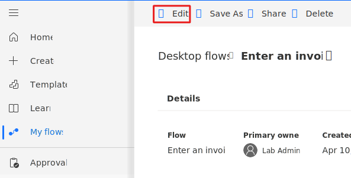
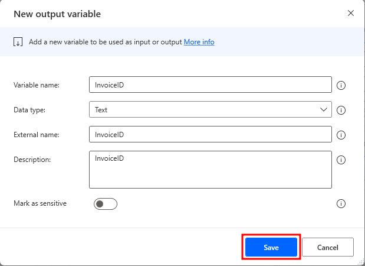

# LAB 3 - Use input and output variables

    
Prerequisites
-------------

This lab builds on the previous  lab (**Lab 2 - Create a desktop flow**). Ensure that you've completed all tasks.

Introduction
============

In the previous lab, you created your first desktop flow that can automate the entering of a new invoice with fixed parameter values for Contoso Coffee shop. However, in reality, your automation should use real input variables instead of fixed values, and you'll likely need to capture real-time output from the automation running result as well.

In this lab, you'll import a solution and learn how to create and use input and output parameters.

Task 0:  Import the solution
==============================

><mark>:information_source:**Note**</mark>
><mark>If you completed the **Lab 2 - Create a desktop flow** lab, skip to the next task.</mark>

To import the solution, follow these steps:

1.  Go to Microsoft [Power Automate](https://powerautomate.microsoft.com/?azure-portal=true) and select the environment that you want to use for this lab.
    
2.  Select **Solutions** and then select **Import solution**.
    
    [
    
3.  Select **Browse**.
    
4.  Select the **InvoiceprocessingsolutionFirstLast\_1\_0\_0\_1.zip** solution file located in the solution folder and then select **Open**.
    
5.  Select **Next**.
    
    
    
6.  Select **Import** and then wait for the solution to import.

Task 1: Use input and output parameters
==========================================

First, you'll need to open the desktop flow that you created in the previous lab. You can open it from the Power Automate for desktop app directly, or you can open it on your browser from the Power Automate website. In the following steps, you'll open the flow from the browser.

1.  Open the browser and then go to [Power Automate](https://powerautomate.microsoft.com/?azure-portal=true).
    
2.  Sign in to Power Automate if needed. Ensure that you're in the correct environment.
    
3.  Select **Solutions** and then open the **Invoice processing solution First Last** solution.
    
4.  Open the **Enter an invoice** desktop flow.
    
5.  Select **Edit**.
    
    
    
6.  In the **Power Automate Desktop** dialog, select **Launch app**.
    
    
    
    Power Automate for desktop lets you receive input values from cloud flows and return values by using output values.
    
    Now, you'll create a series of input values.
    
7.  Within the **Input/output variables** section to the right of the screen, in the **Variables** pane, select the plus (**+**) icon and then select **Input** from the options list to add your first input.
    
    
    
8.  In the **New input variable** dialog, use these values to set up the first input variable:
    
    *   **Variable name** - `Amount`
        
    *   **Data type** - Text
        
    *   **Default value** - `$500`
        
    *   **External name** - `Amount`
        
    *   **Description** - `Amount`

9.  Select the **Save** button in the lower part of the dialog.
    
    
    
10.  Repeat the previous steps to add a second **input** variable.
    

    
11.  Use the following values to set up the second input variable:
    
*   **Variable name** - `Contact`
    
*   **Data type** - Text
    
*   **Default value** - `b.friday@wingtipcups.com`
    
*   **External name** - `Contact`
    
*   **Description** - `Contact email`
        
    

    
12.  Repeat the previous steps again to create a third input variable. Use the information and these values to fill in the variables within the new, third **input** and then select **Save**.
    
*   **Variable name** - `Account`
    
*   **Data type** - Text
    
*   **Default value** - `WingTip Cups`
    
*   **External name** - `Account Name`
    
*   **Description** - `Account Name`
    

    
13.  After you've added and saved all three input variables, select the **Save** button in the upper part of the screen to save changes that you've made within the lab so far.
    

    
14.  To the right of the screen, in the **Variables** pane, in the **Input/output variables** section, select the plus (**+**) icon and then select the **Output** option to add your first output variable.
    

    
15.  Use these values to set up the first output variable:
    
*   **Variable name** - `InvoiceID`
    
*   **Data type** - Text
    
*   **External name** - `InvoiceID`
    
*   **Description** - `InvoiceID`
        
16.  After entering the values for the output variable, select the **Save** button in the lower part of the dialog.
    

    
17.  Add an action to set this output. Ensure that the Contoso Invoicing application is still running. Select step 10: **End of autogenerated actions using the recorder**.
    

    
18.  Go to the **Actions** pane, search for **get details**, and then double-click to add **Get details of the UI element in window**.
    

    
19.  In the **Get details of the UI element in window** dialog, select the **UI element** dropdown menu and then select **Add UI element**.
    

    
>:information_source:**Note**
>After you've selected the **Add UI element** option, a red rectangle will appear on the screen while you hover the mouse cursor over thedifferent elements.
    
20.  Go to the Contoso Invoicing app. On the **Invoice Detail** tab, move the mouse cursor over the number in the **ID** field. Press and hold the **Ctrl** key on your keyboard and then select the ID number.
    
>:information_source:**Note**
>A different ID number might appear than what's shown in this task.

21.  Return to the dialog and select **Save**.
    
>:information_source:**Note**
>Your UI element might appear differently than what's shown in the following figure.

>:information_source:**Note**
>This action will automatically produce a variable called **AttributeValue** that you can refer to in subsequent actions within Power Automate for desktop. You can view the variable from the pop-up window.
    
22.  Select the new step that you added.
    

    

Next, set the **InvoiceID** output variable, which will allow you to use the **Invoice ID** in downstream processes or from your cloud flow in a future lab.

23.  Go to the **Actions** pane, search for **set variable**, and then double-click to add the **Set variable** action.
    

    
24.  Select `NewVar` next to **Variable** and select the **{x}** button to pull up the variable menu and select `InvoiceID`.
    

    
25.  Select the **{x}** button in the **Value** section and double-click **AttributeValue** from the list.
    

    
26.  Select the **Save** button in the lower part of the **Set variable** dialog.
    

    
27.  Set up the steps to use input variable values when you're running the automation. Select step 5: **Edit 'TextBox' with 'WingTip Cups'**, and then on the right, select the ellipsis (**...**) menu. From the options menu, select **Edit**.
    

    
28.  In the **Populate text field in window** dialog, delete the value in the **Text to fill-in** field.
    
29.  Select the **Account** variable (one of the input variables that you previously created) by selecting the **{x}** icon and then double-clicking to select **Account**.
    

    
30.  Select **Save**.
    

    
31.  Repeat the previous steps to change the value of **Text to fill-in** in **Step 6** and **Step 7** in the desktop flow.
    
    *   Use the **Contact** input variable for **Step 6**
        
    *   Use the **Amount** input variable for **Step 7**
        
32.  When you've finished, your actions should resemble the following figure.
    

    
33.  Select the **Save** icon to save all your changes.
    

    
34.  Now, you've completed the process of setting up and using inputs and outputs in your desktop flow. In the next labs, you'll use those inputs and outputs to pass data values between cloud flows and desktop flows. Next, you can test your flow by selecting the **Run** icon in the lower part of your screen and then watch the automation run by using the input variable values (default values).
    

    
35.  Close the Power Automate for desktop application.
    

-------
## Congratulations!

In this lab, you imported a solution and also set up and used inputs and outputs in your desktop flow. You tested your flow and watched the automation run by using the input variable values.

In the next labs, you'll use those inputs and outputs to pass data values between cloud flows and desktop flows.
