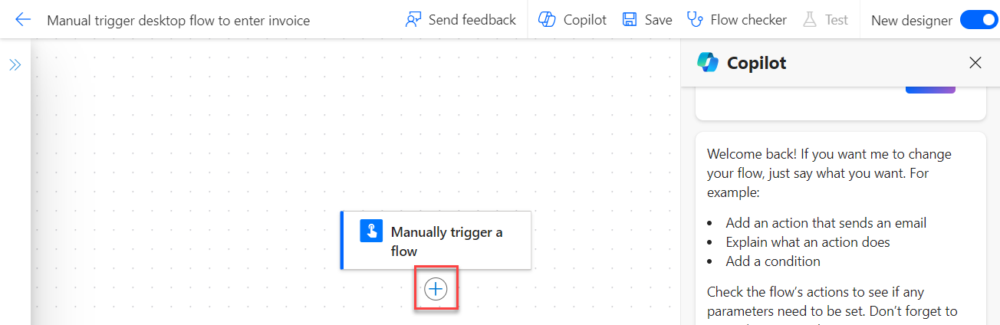
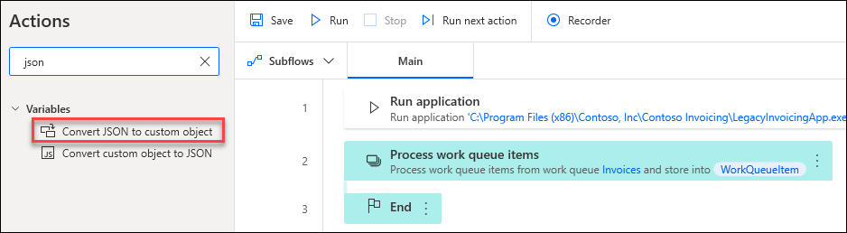

# LAB 4 - Integrate with cloud flows

Prerequisites
-------------

This lab builds on the previous lab (**Lab 3 - Use input and output variables**), so make sure you have completed the previous lab or import the provided solution in the resources folder.
    

Introduction
============

In the previous labs, you created a desktop flow that enters a new invoice entry for Contoso Coffee shop by using the provided input variables. The input variables could come from previous process steps, such as when a new invoice file is being received and processed and data is being extracted from the file. You can automate those steps by using a Microsoft Power Automate cloud flow, which has hundreds of connectors that you can choose from. In this lab, you'll learn how to create a cloud flow and connect it with the desktop flow that you've created so that business data for your Contoso Coffee shop can flow from the cloud to your desktop.

You'll complete the following tasks in this lab:

*   Create your first cloud flow.
    
*   Set up a machine connection to enable the cloud flow to run the desktop flow on your computer.
    
*   Add the **Enter invoice with input** desktop flow to this new cloud flow.
    
*   Perform a test run of the new cloud flow that will run the desktop flow on your computer
    

Learn about machines
--------------------

Machines are the physical or virtual devices that are used to run your Power Automate processes. When you connect your machine to Power Automate, you can instantly start your desktop automation by using any available trigger, such as when you receive an email or on a predefined schedule.

Connecting your machine directly to Power Automate and the cloud will allow you to harness the full power of your robotic process automation (RPA). The easiest way to connect your machine to the cloud is with direct connectivity. With that approach, your only task is to ensure that you've installed and signed in to the latest version of Power Automate for desktop. Then, your machine will be registered with Power Automate automatically. After you've registered your machine, you can create a connection immediately in your cloud flows.

>:information_source:**Note**
>Direct connectivity is only available for versions of Power Automate for desktop 2.8.73.21119 or newer. If you're using an older version, you'll need to [update to the latest](https://go.microsoft.com/fwlink/?linkid=2102613).

Task 0: Import the solution
===================

><mark>:information_source:**Note**</mark>
><mark>If you completed the **Lab 3 - Use input and output variables** lab, skip to the next task.</mark>

1.  Go to [https://powerautomate.microsoft.com](https://powerautomate.microsoft.com/?azure-portal=true) and select the environment that you want to use for this lab.
    
2.  Select **Solutions > Import solution**.
    
    
    
3.  Select **Browse**.
    
4.  Select the **InvoiceprocessingsolutionFirstLast\_1\_0\_0\_2.zip** solution file located in the resources folder and then select **Open**.
    
5.  Select **Next**.
    
    
    
6.  Select **Import** and then wait for the solution to be imported.

Task 1: Create a cloud flow and a connection
===============================================

>:information_source:**Note**
>To use the functionality in this lab, you'll need to own a paid or trial version of [premium per-user plan with attended RPA](/en-us/power-automate/desktop-flows/manage-machines/?azure-portal=true). If you've completed the lab 1 prerequisite, you should already have a premium trial.

1.  Open a new window browser and then go to [https://make.powerautomate.com](https://make.powerautomate.com/?azure-portal=true). Sign in if needed.
    
2.  Select **Create** and then select the second option under Start from blank titled **Instant cloud flow**.
    
    
    
3.  This causes the Build an instant cloud flow dialogue box to pop up. Name the flow `Manual trigger desktop flow to enter invoice` then select **Manually trigger a flow**. Select **Create**.
    
    
    
4.  Add a step by selecting the **+** icon under the **Manually trigger a flow** action card.
    
    
    
5.  Enter `desktop flow` in the search box and then select **Run a flow built with Power Automate for desktop** located under Desktop Flows.
    
    
    
6.  In the **Connection Name** box, type `My Computer`. Select **Connect with username and password** from the **Connect** dropdown menu and then select the machine that you registered in the setup lab from the **Machine or machine group** dropdown menu.
    
    
    
7.  Provide your sign-in user and password information.
    
    >:information_source:**Note**
    >If you're uncertain of what to enter in the **Domain and username** field, you can use the **Command Prompt** window (open Windows **Start** menu, enter **CMD**, and then press the **Enter** key). Enter the **whoami** command and press the **Enter** key to locate the domain and username. Fill in the textbox with **USERDOMAIN\\USERNAME**.
    >If this account isn't a domain account, then use the **Set computer** command to look for the computer name. Fill in the text with **COMPUTERNAME\\USERNAME**.
    
    >:green_book:Tip
    >To make sure that you have the correct sign-in credentials, try signing out of the computer and using the username/password combination to determine if you can successfully sign in to this computer.
    
    >:warning:Important
    >The account that you plan to use must have local admin rights on your machine.
    
8.  Select **Create New**.
    
    
    
9.  After setting up the connection, you can always view and select your connection by selecting the **Run a flow built with Power Automate for desktop** action card and then selecting **Change connection reference**.
    
    
    
    >:information_source:**Note**
    >You can also create new connections here if needed. You can do this by selecting **Add New**. This step is not necessary for this lesson.
    
10.  Select **Enter an invoice** from the **Desktop flow** dropdown menu.
    
11.  From the **Run Mode** dropdown menu, select **Attended (runs when you're signed in)**. This mode runs the desktop flow while you're signed in to the same machine. Unattended mode is for running flows on server machines without users needing to sign in.
    

    
12.  Fill in the **Amount**, **Contact**, and **Accountname** boxes with the following sample input values (you're using static input values for now and will learn in the next labs how to use dynamic input values):
    
*   **Amount** - `$200`
        
*   **Contact** - `b.friday@wingtipcups.com`
        
*   **Account name** - `WingTip Cups`
        
    

    
13.  Select **Save**, located at the top right-hand corner, and then wait for the flow to be saved.
    

    
14.  Select **Test** in the upper-right corner of the screen.
    

    
15.  From the **Test Flow** dialog, select **Manually** and then select **Test**.
    

    
16.  Determine if the required connections are correctly configured. If a green check mark appears to the right of **Desktop flows**, then you're ready to continue. Select **Continue**.
    

    
17.  Select **Run flow**.
    

    
18.  Select **Done** if your flow run started successfully.
    
>:information_source:**Note**
>Don't interact with your device while testing.
    
19.  Watch as your desktop flow is triggered from the cloud and runs on your desktop.
    
After your flow runs successfully, the run detail page will display.
    

    
20.  Now we're going to connect the flow to the solution we previously created. To begin, select the back arrow at the top left of the screen next to the name of the flow.
    

    
21.  Select **Solutions** and then select the previously created **Invoice processing solution First Last**.
    

    
22.  After clicking on the solution, select the **Add existing** drop-down menu at the top of the page. Then select **Automation** and then **Cloud flow**.
    

    
23.  The Add existing cloud flows dialogue box pops up. Select the **Outside Dataverse** tab in the box. Then select the flow **Manual trigger desktop flow to enter invoice** and finally, select **Add**.
    

    

Now the flow is linked to the solution.

Task 2: Monitor the list of machines
=======================================

After a machine has been registered to an environment, you can view its details from the Power Automate website. You can also view all other machines that you have access to. To do so, follow these steps:

1.  Select the **More** drop-down from the navigation menu and then select **Machines**.
    
2.  View the following details for each machine from the list:
    
    *   Name of the machine
        
    *   Description of the machine
        
    *   Group that the machine is a part of, if applicable
        
    *   Status of the machine
        
    *   Number of flows that are running on the machine
        
    *   Number of flows that are queued on the machine, if applicable
        
    *   Type of access that you have to the machine
        
    *   Owner of the machine
        
    
    
    
3.  Under the **More** drop-down in the navigation pane, select **Desktop Flow Activity**.
    
    
    
4.  Navigate through the tabs and view the information provided.
    
    *   The **Last Runs** section provides graphs and tables to get meaningful insights about your desktop flow runs, such as the number of runs, the percentage of errors, and the run mode.
    
    
    
    *   The **Errors** section can be used to identify the most common errors that occur while your flows run. These pivot tables provide information about desktop flows, cloud flows, and machines in which errors occurred, allowing you to view details to identify the source of errors.
        
        By default, this section displays the desktop flow run errors for the last seven days. Optionally, you can select another time period and filter on specific errors.
        
    
    
    
    *   The **Machines** section can be used to monitor your machines and machine groups. These pivot tables provide information about the number of machines, groups, connection status, Power Automate for desktop versions installed on machines, and lists of machines and machine groups.
    
    
    
    *   You can use the **Current Runs** section to monitor active desktop flow runs. These pivot tables provide information about the number of running and queued desktop flows, and lists with the running and queued desktop flows.
    
    
    

Task 3: Create a cloud flow with Describe it to design it
============================================================

>:information_source:**Note**
>To use the functionality in this lab, you'll need to own a paid or trial version of [premium per-user plan with attended RPA](/en-us/power-automate/desktop-flows/manage-machines/?azure-portal=true). If you've completed the Lab 1 prerequisite, you should already have a premium trial.

1.  Open a new web browser and navigate to [https://make.powerautomate.com](https://make.powerautomate.com/?azure-portal=true). Sign in if needed.
    
2.  Once in the Power Automate web browser, select **My Flows** from the navigation pane to the left of the screen.
    
3.  Next, select the **\+ New Flow** drop-down from the ribbon at the top of the page.
    
4.  From the drop-down, select **Describe it to design it (preview)**.
    
    
    
5.  If the **Welcome** pop-up dialog appears, select the **X** in the upper right corner to close out.
    
6.  Within the text box at the top of the page, enter `When I receive an email with an attachment send a teams notification`. Then hit **Enter** on your keyboard.
    
7.  Once the flow has loaded and you have checked to make sure it's the correct flow you would like to use, select **Next**.
    
    
    
    
    
8.  Check that you have the correct **connection** within the connected apps and services list, and then select **Create flow**. The connection should show as the same username that you used to sign in to Power Automate. Notice that to the right of the screen, you can also see a preview of the flow being created.
    
    
    
    >:information_source:**Note**
    >If you receive error icon notifications within the connected apps and services list, select **Fix connection**. Use the same account you used to login to Power Automate to fix the connection.
    
9.  You should now be able to begin editing the flow. In the flow, select the **Post a message as the Flow bot to a user** card.
    
10.  Next, expand the **Recipient** field and select **Enter custom value**.
    
11.  Enter your Teams user email
    

    
12.  Expand **Show all** under **Advanced parameters** and within the **Message** text box field, enter the message `You have received a new email with an attachment.`
    

    
13.  Lastly, select the **Save** button located at the top right of the page to save the changes that were just made to the parameters of the newly created flow.
    

    
14.  You should now be viewing a page that displays the flow that you created with the new parameters. After saving in the last step, a green **success message** at the top of the screen will show.
    
>:information_source:**Note**   
>To the right of the screen, you can chat with a **Copilot** bot to make changes to your flow. You can also add to your flow by selecting the **plus** signs below each step.
    

    

You have now completed the flow!

If you desire, you can continue to test your flow by sending yourself an email with an attachment.

Task 4: Create a work queue
==============================

In previous labs, you created an end to end solution to enter an invoice to a legacy application. That solution, which runs a desktop flow from a cloud flow, lets you automatically enter relevant data into the legacy application without having any manual process take place. When triggered, this flow is placed in a queue with all other desktop flows that are set to run and only run when its turn in the queue is up in the order. But, a question remains - what if that order needs to be modified so a specific flow run takes higher priority than others?

**Work queues** in Power Automate play a crucial role in improving the efficiency, scalability, and resiliency of automations and help prioritize work, with the highest-priority items being completed first, regardless of whether they're processed by digital workers, human workers, or through integrations.

Just as manufacturing assembly lines are designed to decouple different complex stages of production, work queues can help decouple different areas of a process allowing each part to operate independently and exchange prioritized inputs and outputs asynchronously.

1.  Go to [Power Automate](https://make.powerautomate.com/) and sign in with your credentials.
    
2.  Within the navigation menu to the left of the screen, select **More** with the ellipses next to it. Then, select **Work queues**.
    
    
    
3.  This takes the user to the work queues section. Select the **\+ New work queue** button or select the **+New** button at the top of the screen to create a new work queue.
    
    
    
4.  In the **New work queue** panel, enter the following information:
    
    *   Work queue name: `Invoices`
5.  Then, select **Create**.
    
    
    
    >:information_source:**Note**
    >If you set an expiration time for a work queue, any item added will expire after the time has elapsed. So if you set expiration time to 30 minutes, an item added at 2:00 PM will expire at 2:30 PM.
    
    
    

Task 5: Create the _Work Queue Item Load_ workflow
------------------------------------------------

1.  From within the **Invoice Processing Solution** created in a previous lab, select **\+ New** from the toolbar at the top. Then, select **Automation** and **Desktop Flow** to create a new desktop flow.
    
    
    
2.  Name the flow _**Work Queue Item Load**_, then select **Launch app**. You're taken to a new tab in your browser and might need to sign into Power Automate Desktop if prompted.
    
    
    
3.  Once in the Power Automate Desktop designer, navigate to the **Excel** section and select the **Launch Excel** action to add as the first step of the workflow.
    
    
    
4.  In the **Launch Excel** action, select the **Launch Excel** parameter dropdown menu and change it to **and open the following document**.
    
    
    
5.  Change the **Document path** and select the file named _**Work Queue Vendor Invoice Items**_ from the folder **Lab #13 Excel file for Work Queues** in the course materials.
    
    
    
6.  Select the toggles as shown here to _turn off_ **Make instance visible** and _turn on_ **Open as ReadOnly**, then select Save.
    
    
    
7.  From within the Excel actions area, select the **Read from Excel worksheet** action and add as the next step.
    
    
    
8.  Select the dropdown menu in the **Read from Excel worksheet** action for Retrieve and select **All available values from worksheet**. Then, select Advanced and toggle **First line of range contains column names** to _on_. Lastly, select the variable produced and add _**Invoices**_ to the name of the variable to display as **ExcelDataInvoices**.
    
    
    
    >:information_source:**Note**
    >It is a best practice to rename variables as necessary to make it easier to understand the purpose of the variable and how it is to be referenced.
    
9.  Navigate to the Loops actions section and select the **For Each** loop action.
    
    
    
10.  Select the variable icon to choose the **ExcelDataInvoices** variable to iterate over, then edit the name of the variable that the data is stored into to be _**CurrentInvoice**_ and select Save.
    

    

    
11.  Navigate to the Work Queues section in the Action pane and select the **Add work queue item** action. Ensure to drag the action _**inside of the For Each loop**_.
    

    
12.  Within the dialog box, add the following information, then select Save.
    
*   Work Queue: **Invoices**
        
*   Status: **Queued**
        
*   Priority: **Normal**
        
*   Name: `%CurrentInvoice['InvoiceItemID']%`
        
*   Input:
        
              {
               "AccountName": "%CurrentInvoice['AccountName']%",
               "ContactEmail": "%CurrentInvoice['ContactEmail']%",
               "Amount": "%CurrentInvoice['Amount']%"
              }
            
        
    
    
    
>:information_source:**Note**
>The square brackets \[ \] with single quote ' ' designate a column to be referenced.
    
>:information_source:**Note**
>The input in this case is a JSON object that is storing data in name/value pairs.
    
13.  Navigate to the Excel section in the Actions pane and add the **Close Excel** action as the last step in the flow, outside of the For Each loop. You don't need to make any modifications to this action.
    

    

    
14.  Select the **Save** button and then select the **Run** button to run the workflow.
    
15.  Close the Power Automate Desktop designer window.
    
16.  Navigate to the Power Automate cloud flow portal at make.powerautomate.com and select **More** and choose **Work Queues** from the menu. Notice the 30 queued items for the Invoice work queue.
    

    
17.  Select the Invoice work queue, and notice the list of items, then choose **See all** to view the full list of items that are queued by the recently run workflow.
    

    

18.  Return back to Power Automate Desktop.
    
19.  Select the ellipses for the **Enter an Invoice** flow created in an earlier lab and select **Create a copy** from the dropdown list.
    

    
20.  Rename the new flow to: **Work Queue Item Processor**
    

    
21.  Select the new flow **Work Queue Item Processor** and select the **pencil** icon to edit it.
    

    
22.  Navigate to the **Work Queues** section in the Action pane and select the **Process work queue items** action. Insert this action after the **Run Application** step already included in the flow.
    
>:information_source:**Note**
>This should be the new action 2 in the workflow.
    

    
23.  Select the **Invoices** work queue from the dropdown.
    

    
24.  In the **Actions** pane, search for `Json` and select the **Convert JSON to custom object** action, making sure to add inside of the newly created Process work queue item loop.
    

    
25.  Select the variable icon **{x}** to choose the JSON value to convert. From the dropdown list, scroll down and select the expand arrow for **WorkQueueItem**, then select the **.Value** option. Click Select to add this to the parameter area. Once added, select Save.
    

    

    
26.  Select the **Save** button at the top of the window.
    
27.  Select the number 4 in the list of actions to add a **Breakpoint** to the flow. This Breakpoint stops the flow at the action it's added to, and allows users to view the details of the flow at that stage.
    

    
28.  Select the **Save** and **Run** buttons at the top of the window.
    
29.  Double-click on the **JsonAsCustomObject** variable from the Flow variables area in the Variables pane to view the output details from the flow that is running.
    

    
Notice the data that was parsed from the JSON that can now be used as Name/ Value pairs. Select **Close** to close out of the window.
    

    
30.  Select the **Stop** button at the top of the designer window.
    

    
31.  Within the Work Queues section in the Action pane, select the **Update work queue item** action and drag into the list of actions after the **Convert JSON to custom object** step inside the for loop.
    

    
32.  Add the Processing result: **Success** into the dialog box for Update work queue item and select **Save**.
    

    
33.  Select the **Save** and **Run** buttons at the top of the window.
    
34.  Return to the **Power Automate** web browser at the Invoice Work Queue previously visited. Refresh the browser tab and select **See all**.
    

    
35.  Scroll down to the bottom of the list and notice the item that processed during the previous desktop flow run.
    

    
36.  Return back to the desktop flow designer and select the **Stop** button at the top of the window.
    
37.  Holding down the **Ctrl** key on your keyboard, select all of the actions from the original Enter an Invoice desktop flow then, drag all of those steps into the **Process work queue items** loop, between the Convert JSON to custom object and Update work queue item actions.
    

    
38.  Edit the three steps that **Populate text field in window** and remove the previously used Input variable to replace the _Text to fill in_ with a value from the parsed JSON stored in the **JsonAsCustomObject** variable.
    

    
39.  Use the following to replace the _Text to fill in_ for each action:
    
*   Account Textbox: `%JsonAsCustomObject['AccountName']%`
*   Contact Textbox: `%JsonAsCustomObject['ContactEmail']%`
*   Amount Textbox: `%JsonAsCustomObject['Amount']%`
    

    

    

    
40.  If there's a **Breakpoint** on line 16, remove it. Select **Save** and **Run** one final time to see all of the work queue items processed by this flow.
    

    
41.  Return to the Power Automate cloud portal and notice the completed work queue item runs in the **Invoice** work queue.
    

    

-------
## Congratulations!

By completing the tasks in this lab, you learned how to:

*   Create your first cloud flow.
    
*   Set up a machine connection to enable the cloud flow to run the desktop flow on your computer.
    
*   Add the **Enter invoice with input** desktop flow to the new cloud flow.
    
*   Perform a test run of the new cloud flow that will run the desktop flow on your computer.