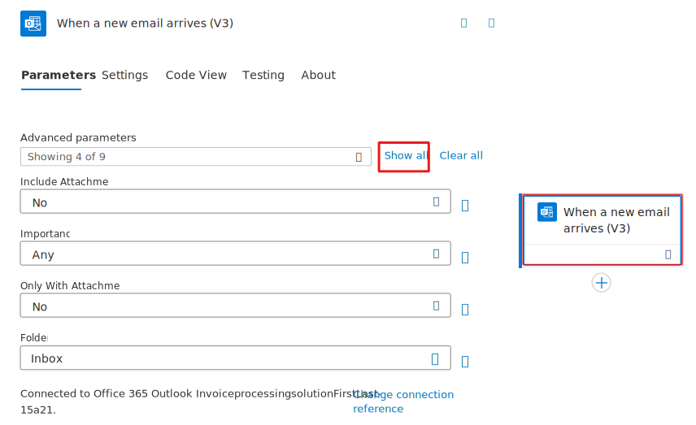
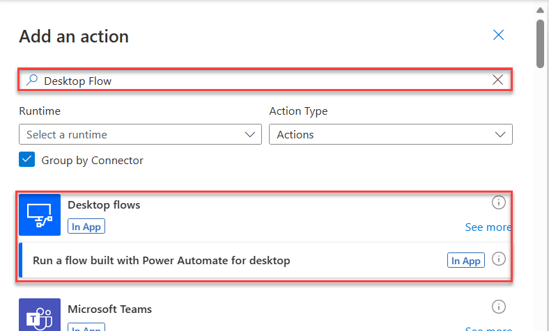

---
lab:
    title: '[Lab 05] Use Outlook to trigger desktop flows and pass inputs'
    module: 'Power Automate'
---
# LAB 5 - Use Outlook to trigger desktop flows and pass inputs

Prerequisites
-------------

Before you begin the tasks in this lab, make sure that you meet the following prerequisites:
    
*   Complete the **Lab 4 - Integrate with cloud flows** or import the provided solution in the resources folder
 
Introduction
============

In a previous lab, you created a sample cloud flow that can run a desktop flow on your computer and then enter the invoice information for Contoso Coffee shop. However, you'll need to manually trigger that cloud flow to run every time. The Contoso Coffee shop uses Microsoft Outlook email to receive incoming invoices from different vendors as attachment files. Therefore, your next task is to build a new cloud flow that automatically triggers whenever an email arrives to that inbox. To do so, you'll need to use an Outlook connector in the cloud flow.

You'll complete the following tasks in this lab:

*   Create a new solution to package the end-to-end invoice processing solution.
    
*   Create a new cloud flow that initiates the invoicing process through the receipt of an email.
    
*   Integrate the desktop flow from Lab 2 into the cloud flow.
    
*   Perform a test run of the new cloud flow.
    

Task 0:
-------
Import the solution
===================

><mark>:information_source:**Note**</mark>
><mark>If you've completed the lab  **Lab 4 - Integrate with cloud flows** or import the provided solution in the resources folder, skip to the next task.</mark>

To import the solution, follow these steps:

1.  Go to [https://powerautomate.microsoft.com](https://powerautomate.microsoft.com/?azure-portal=true) and select the correct environment.
    
2.  Select **Solutions** and then select **Import solution**.
    
    
    
3.  Select **Browse**.
    
4.  Select the **InvoiceprocessingsolutionFirstLast\_1\_0\_0\_3.zip** solution file located in the resources folder and then select **Open**.
    
5.  Select **Next**.
    
    
    
6.  Select **New connection**.
    
    
    
7.  Select **Direct to machine**, select the machine that you registered setup of the first lab in the Learning Path **Install required software - Online workshop**., provide your sign-in information, and then select **Create**.
    
    
    
8.  Close the connections browser window or tab.
    
9.  Select **Refresh**.
    
    
    
10.  Select the connection that you created and then select **Import**.

    
11.  Wait for the solution to be imported.
    

Task 1:
-------
Use an Outlook email to trigger a desktop flow and pass input
========================================================================

In this task, you'll use an Outlook email to trigger a desktop flow and pass input from a cloud flow.

1.  Go to [https://make.powerautomate.com](https://make.powerautomate.com/?azure-portal=true) and make sure that you're in the correct environment.
    
2.  Select **Create** from the navigation pane and then select **Automated cloud flow**.
    
    
    
3.  Enter `Use Outlook email to trigger Desktop flow` in the **Flow name** field. Search for and select **When a new email arrives (V3) - Office 365 Outlook** as the trigger event and then select the **Create** button.
    
    
    
4.  Sign in if prompted.
    
5.  In the **When a new email arrives (V3)** trigger card, select the card to show the advanced options. Stay on the **Parameters** tab within the advanced options.
    
    >:information_source:**Note**
    >You can check your connection by selecting the ellipsis (**...**) in the upper-right corner of the box.
    
    
    
6.  Select **Show all** next to the Advanced parameters dropdown box. Then select **Yes** from the **Include Attachments** dropdown and select **Yes** from the **Has Attachment** dropdown menu (your menu might read **Only with Attachments**, depending on the version of Outlook connector).
    
    
    
7.  Enter `new invoice` in the **Subject Filter** field.
    
    
    
8.  Select the **+** button below the **When a new email arrives (V3)** trigger card. Then select **Add an action**.
    
9.  Search for `Desktop flow` in the search bar and then select **Run a flow built with Power Automate for desktop**.
    

    
10.  Select **Enter an invoice** from the **Desktop flow** dropdown menu and then select **Attended** from the **Run Mode** dropdown menu.
    
11.  Fill in the **Amount**, **Contact**, and **Account Name** boxes by using the following values. You'll switch these values later in future labs to use Microsoft Dynamics 365 input values. For now, you'll use static values.
    
*   **Amount** - `$200`
        
*   **Contact** - `b.friday@wingtipcups.com`
        
*   **Account Name** - `WingTip Cups`
        
    

    
12.  **Save** the flow by selecting the **Save** button and then wait for the flow to be saved. A green success message will show at the top after it has been saved.
    
13.  **Test** the flow by selecting the **Test** button in the upper-right corner of the screen.
    

    
14.  From the **Test Flow** pane, select the **Manually** option and then select **Test**.
    
An empty flow run history page will display. Because this flow has a trigger, the flow will run automatically if that trigger condition happens (when a new email arrives).
    

    
15.  Open an email app to draft an email. You'll send the email to the inbox of the account that your trigger action is monitoring (which is the account that you used to sign in when creating the trigger connection).
    
16.  In the email body, add **newinvoice.jpg file** as an attachment (you can find this .jpg file under the **lab data package** folder).
    
17.  Enter **New invoice** in the subject line. Then, select **Send** to test this flow.
    

    
18.  After the email has been received by the inbox that your flow trigger is monitoring, it will trigger the flow run automatically. Return to the flow run history page, where you can observe that your flow has run successfully and has launched the desktop flow on your computer as well.
    

    
>:information_source:**Note**
>Occasionally, in the test account tenant, emails might be blocked due to spam concerns. If you receive an error while sending an email, try sending it from another account and then be sure to include the attachment and correct subject line.
    
19.  It's best practice to add the flow inside of the solution. To begin this connection process, make sure you have the **Invoice processing solution First Last** solution selected by clicking on **Solutions** in the navigation pane and selecting it from the list.
    

    
20.  After selecting the correct solution, you'll be brought to a page that shows all of the flows inside of that selected solution. On this page, select **Add existing** then **Automation** and then **Cloud Flow**.
    

    

This causes the **Add existing cloud flows** dialogue box to show on the right side of the screen. Select the **Outside Dataverse** tab. Then select the flow `Use Outlook email to trigger Desktop flow` and select **Add**.

Now the flow is connected to the correct solution.

-------
## Congratulations!

In this lab, you learned how to complete the following tasks:

*   Create a new solution to package the end-to-end invoice processing solution.
    
*   Create a new cloud flow that initiates the invoicing process through the receipt of an email.
    
*   Integrate the desktop flow from lab **Lab 2 - Create a desktop flow** into the cloud flow.
    
*   Perform a test run of the new cloud flow.
