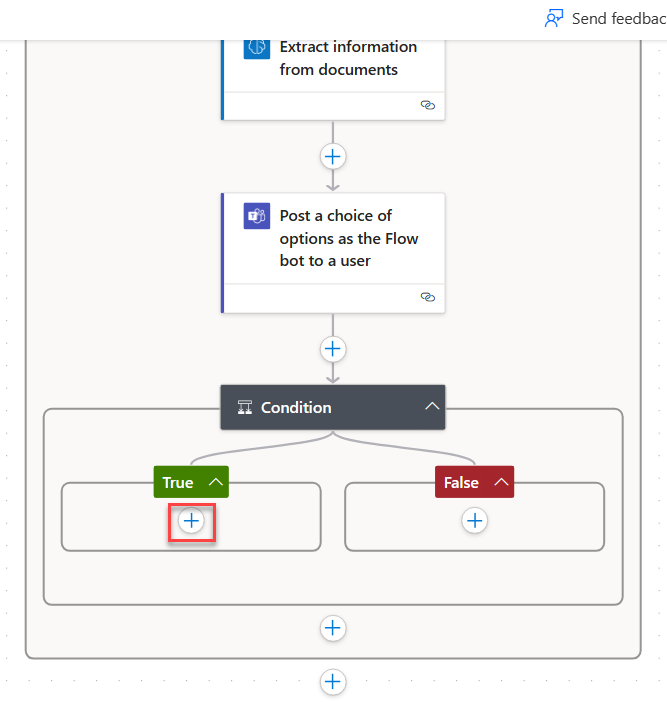

# LAB 7 - Integrate with Microsoft teams to get approvals

Prerequisites
-------------

Before you begin the tasks in this lab, make sure that you meet the following prerequisites:
    
*   Complete the **Lab 6 - Add an AI model to process invoice forms** or import the provided solution in the resources folder

Introduction
============

In previous labs, you created a cloud flow for Contoso Coffee shop that triggers when you receive a new email with an invoice file attachment in the Microsoft Outlook inbox. It uses AI Builder to parse data information out of the invoice file attachment and uses that information to enter the Contoso Coffee shop invoice management desktop app through a desktop flow.

Now, the Contoso Coffee shop company can use this automation to process invoices automatically, and they don't need to manually check email or enter data step by step. However, the Contoso Coffee shop company wants to make sure that the automation doesn't send payments to vendors automatically because it has financial consequences. The company wants a human supervisor to approve and confirm that the invoice is real and ready for payment before the automation can move to the next step. Microsoft Power Automate provides seamless, built-in human approval mechanisms that they can use for those types of scenarios.

In this lab, you'll complete the following tasks, which completes the end-to-end invoice processing solution:

*   Integrate a Microsoft Teams-based approval model and the associated conditional logic into the invoice processing cloud flow.
    
*   Integrate the desktop flow for entering the invoice information into the approval process.
    
*   Integrate Outlook-based approval/rejection notifications into the invoice process.
    
*   Perform a test of the end-to-end invoice processing cloud flow.
  

Task 0: Import the solution (optional)
==============================

><mark>:information_source:**Note**</mark>
><mark>If you completed **Lab 6 - Add an AI model to process invoice forms** lab, skip to the next task.</mark>

To import the solution, follow these steps:

1.  Go to [Power Automate](https://powerautomate.microsoft.com/?azure-portal=true) and select the correct environment.
    
2.  Select **Solutions** and then select **Import solution**.
    
    
    
3.  Select **Browse**.
    
4.  Select the **InvoiceprocessingsolutionFirstLast\_1\_0\_0\_5.zip** solution file located in the resources folder and then select **Open**.
    
5.  Select **Next**.
    
    
    
6.  Select **Next** again.
    
7.  Select **New connection** for the desktop flow.
    
    
    
8.  Select **Direct to machine**, select the machine that you registered in the Lab 1, provide your sign-in information, and then select **Create**.
    
    
    
9.  Close the connections browser window or tab.
    
10.  Select **Refresh**.
    

    
11.  Select **New connection** for Office 365.
    

    
12.  Select **Create**.
    
13.  Provide your credentials.
    
14.  Close the connections browser window or tab.
    
15.  Select **Refresh**.
    
16.  Select **New connection** for Microsoft Dataverse.
    

    
17.  Select **Create**.
    
18.  Provide your credentials.
    
19.  Close the connections browser window or tab.
    
20.  Select **Refresh**.
    
21.  You should now have desktop flow, Office 365, and Microsoft Dataverse connections. Select **Import**.
    

    
22.  Wait for the solution to import.
    
Task 1: Use Microsoft Teams to get approvals
===============================================

In this task, you'll Use Microsoft Teams to get approvals.

1.  Open a new web browser and go to [Power Automate](https://powerautomate.microsoft.com/?azure-portal=true). Sign in if needed.
    
2.  Select **Solutions** from the left menu and then open the **Invoice processing solution First Last**.
    
    
    
3.  Open the **Enter invoice information flow** that you created.
    
    
    
4.  From the toolbar, select the **Edit** button.
    
    
    
5.  Expand the **Apply to each** box. Select the **Send an email (V2)** action, and after the parameters box pops up, select the ellipsis (**...**) and select **Delete** from the options menu.
    
    
    
6.  In the **Delete Step** dialog, select **OK**.
    
7.  Below the **Extract information from documents** action, select **Add an action**.
    
    
    
8.  In the search bar for the new action, search for `Teams post a choice`. From the search bar above the **Actions** list, then select **Post a choice of options as the Flow bot to a user** under the first **Microsoft Teams** set of actions.
    
    
    
>:warning:Important
>You can take the next actions after following one of two approaches. In one approach, you can use a simple method that requires the **Post a choice of options as the Flow bot to a user** action. A richer, more innovative approach requires the **Post an Adaptive Card and wait for a response** action that uses the Adaptive Cards technology from Microsoft.
        
9.  A **Create connection reference** box pops up only giving the option to sign-in. Select **sign-in** and use the same account as you've been previously using in the lab.
    

    
10.  In the **Options Item - 1** box, enter `Yes`.
    
11.  Select **Add new item**. In the **Options Item - 2** box, enter `No`. Then select **Show all** to see all of the parameters.
    
12.  Use the following values to fill in the information for the **Recipient**, **Message**, and **Headline** boxes. Find the values for the **Message** field by searching for them within the **Dynamic content** pane (the blue lightning bolt button):
    
**Recipient** -   _Your username_
    
**Message** -   `We've received an invoice in the amount of` **Total value** _(from dynamic content under the **AI Builder** action)_`, on the date` **Date value** _(from dynamic content under the **AI Builder** action)_`. The contact person is` **Contact value** _(from dynamic content under the **AI Builder** action)_`. Would you like to approve this?`
    
**Headline** -   `Please approve this invoice.`
    

    
13.  Add a branch into your flow so that the automation performs different action paths based on different approval return results. Select **Add an action**.
    

    
14.  In the search bar, search for `condition`. From the **Actions** tab, select **Condition**.
    

    
15.  In the **Choose a value** field, select **selectedOption** (from dynamic content, under the previous action of _**Post a choice of options as the Flow bot to a user**_).
    

    
16.  In the **Choose a value** field, enter the value of `Yes`.
    

    
17.  Navigate back to the flow model and select the **+** sign under **True**. Then select **Add an action** in order to add an action.
    

    
18.  In the **Add an action** dialogue pane, select the **search bar** and type in `run a flow`. Then select the **Run a flow built with Power Automate for desktop** action located under **Desktop flows**.
    

    
19.  Select **Enter an invoice** from the drop-down menu in the **Desktop Flow** field. Next, select **Attended (runs when you're signed in)** from the drop-down menu in the **Run Mode** field.
    

    
20.  Using the dynamic content from your AI model, fill out the **Amount** field with `Total value`, **Contact** with `Contact value`, and **Account name** with `Bill to value`.
    
21.  The **Run a flow** step should be added. Select the **+** sign and **Add an action** to add another action to the flow.
    

    
22.  Within the search bar, search for `reply to email`. Then, select the **Reply to email (V3)** action under the **Office 365 Outlook** group on the list.
    

    
23.  Use the following information and value to fill in the fields within the new action.
    
*   **Message ID** - _Message ID (from dynamic content for the **When a new email arrives (V3)** action)_
24.  Select **Show all** under **Advanced parameters**.
    
*   **Body** - `Your invoice of amount` **Total value** (_from dynamic content under the AI Builder action_) `is approved.`
25.  In the **Subject** field, enter `Your invoice is approved`.
    

    
26.  **Collapse** the actions in the **True** branch by selecting the titles of the actions.
    
Next, create the steps for the case if the approval result was **No**.
    
27.  Select **Add an action** under the **False** branch.
    

    
28.  Within the search bar, search for `reply to email`. Then, select the **Reply to email (V3)** action under the **Office 365 Outlook** group on the list.
    

    
29.  Use the following values and information to fill in the fields in the newly added action. Use the **Dynamic content** pane to search for specific values that are needed for some fields.
    
*   **Message ID** - _Message ID (from dynamic content for the **When a new email arrives (V3)** action)_
30.  Select **Show all** under **Advanced parameters**.
    
*   **Body** - `Your invoice of amount` **Total value** (_from dynamic content from the AI Builder action_) `was rejected.`
31.  In the **Subject** field, enter `Your invoice is rejected`.
    

    
32.  From the toolbar, in the upper-right corner, select **Save**. Then, select **Test**.
    

    
33.  On the **Test Flow** pane, select **Manually > Test**.
    
34.  In a separate web browser tab, open the **Microsoft Teams** app (browser version, not desktop) and then sign in by using the same test account. You can find the web version of Microsoft Teams by going to [https://teams.microsoft.com](https://teams.microsoft.com/?azure-portal=true).
    
35.  In another separate web browser tab, open the **Office 365 Outlook** app. You can find the web version of Microsoft Outlook by going to [https://outlook.office.com/mail](https://outlook.office.com/mail/?azure-portal=true).
    
36.  In Outlook, compose a new email with the following settings:
    
*   **To** - _(email address of the user identity that you're using in this lab)_
        
*   **Subject** - `New invoice`
        
*   **Attachments** - new-invoice.jpg _(from the lab resource files)_
        
    

    
37.  Send the email and then wait for the flow to run.
    
38.  Wait for an **approval request Adaptive Card** to appear in the **Teams** tab. Select **Yes** or **No**, and then select **Submit** to approve or reject the invoice as desired.
    

    
39.  On the **Outlook** tab, check for a confirmation email that matches the option that you selected.
    

    
40.  Repeat the test by using the other test case (accept or reject).
    
41.  Similar to previous labs, you can monitor the run status from the flow details page and run details page. Return to the **Enter invoice information flow**. Your flow should run successfully.
    

-------
## Congratulations!

In this lab, you completed the end-to-end invoice processing solution with these tasks:

*   Integrate a Microsoft Teams-based approval model and the associated conditional logic into the invoice processing cloud flow.
    
*   Integrate the desktop flow for entering the invoice information into the approval process.
    
*   Integrate Outlook-based approval/rejection notifications into the invoice process.
    
*   Perform a test of the end-to-end invoice processing cloud flow.
    
