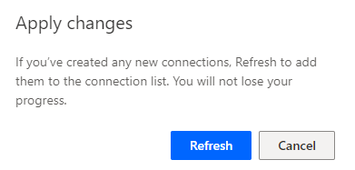
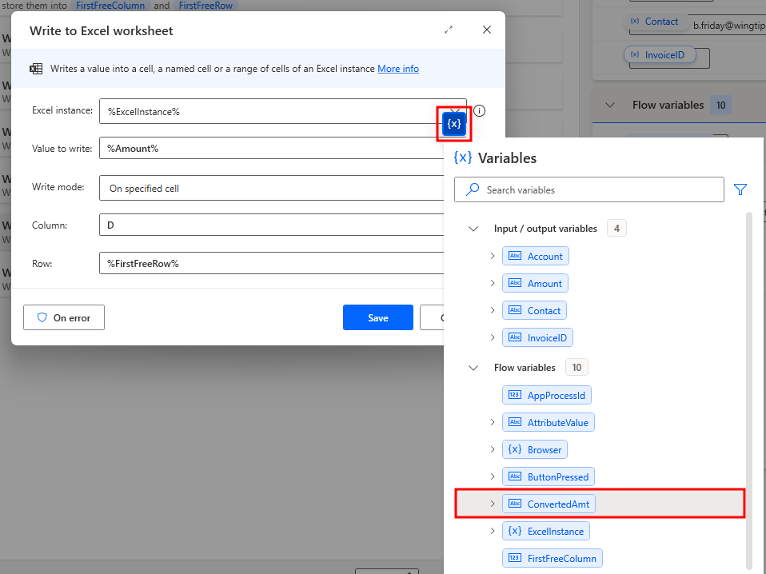

---
lab:
    title: '[Lab 08] Create subflows and web automation with Power Automate for desktop'
    module: 'Power Automate'
---
# LAB 8 - Create subflows and web automation with Power Automate for desktop

Prerequisites
-------------

Before you begin the tasks in this lab, make sure that you meet the following prerequisites:
    
*   Complete the **Lab 7 - Integrate with Microsoft teams to get approvals** or import the provided solution in the resources folder

Introduction
============

In previous labs, you created a cloud flow that's triggered to run automatically whenever a new invoice email arrives at the Contoso Coffee shop company email inbox. This cloud flow extracts the invoice details data from the attachment invoice file by using AI Builder, and then it sends an approval request to a human supervisor to confirm that it's real and ready to process. Then, the cloud flow runs a desktop flow to enter the invoice details in the Contoso Coffee shop invoice management desktop app. Finally, the cloud flow responds with confirmation to the vendors who sent the invoice. This lab completes an end-to-end automation to process the incoming vendor invoices for Contoso Coffee shop.

In this lab's scenario, you've learned that Contoso Coffee shop also needs to complete another step after processing a new incoming invoice. They need to record the invoice information into an existing Microsoft Excel file, which other departments use for auditing purposes. Furthermore, if you're working in an international branch in Europe, you're required to convert the invoiced amount from USD to EUR by using a real-time currency conversion rate, and then you'll need to log the converted amount into the Excel file. The Microsoft Power Automate for desktop app can also help you complete this type of task because it can automate against Windows applications and against any website.

Task 0: Import the solution (optional)
==============================

><mark>:information_source:**Note**</mark>
><mark>If you've already completed  **Lab 7 - Integrate with Microsoft Teams to get approvals**, skip to the next task.</mark>

To import the solution, follow these steps.

1.  Go to [Power Automate](https://powerautomate.microsoft.com/?azure-portal=true) and select the correct environment.
    
2.  Select **Solutions** and then select **Import solution**.
    
    
    
3.  Select **Browse**.
    
4.  Select the **InvoiceprocessingsolutionFirstLast\_1\_0\_0\_6.zip** solution file located in the resources folder and then select **Open**.
    
5.  Select **Next**.
    
    
    
6.  Select **Next** again.
    
7.  Select **New connection** for the desktop flow.
    
    
    
8.  Select **Direct to machine**, select the machine that you registered in the Lab 1, provide your sign-in information, and then select **Create**.
    
    
    
9.  Close the connections browser window or tab.
    
10.  Select **Refresh**.
    
    
    
11.  Select **New connection** for Microsoft Office 365.
    
    
    
12.  Select **Create**.
    
13.  Provide your credentials.
    
14.  Close the connections browser window or tab.
    
15.  Select **Refresh**.
    
16.  Select **New connection** for Microsoft Dataverse.
    
17.  Select **Create**.
    
18.  Provide your credentials.
    
19.  Close the connections browser window or tab.
    
20.  Select **Refresh**.
    
21.  Select **New connection** for Microsoft Teams.
    
22.  Select **Create**.
    
23.  Provide your credentials.
    
24.  Close the connections browser window or tab.
    
25.  Select **Refresh**.
    
26.  You should now have a desktop flow and Office 365, Microsoft Dataverse, and Microsoft Teams connections. Select **Import**.
    

    
27.  Wait for the solution to be imported.
    
28.  Open the imported **Invoice processing solution**.
    

    
29.  Select **Cloud flows** and then open **Enter invoice information flow**.
    

    
30.  Select **Edit**.
    
31.  Expand the **Apply to each** and the **Post a choice of options** steps.
    
32.  Change the **Recipient** email to your user's email address.
    

    
33.  Select **Save** and then wait for the flow to be saved.
    
Task 1: Build a Power Automate for desktop subflow to write notes into Excel
===============================================================================

Completed

*   15 minutes

In this task, you create a process within Power Automate for desktop that writes the values of variables that you created earlier into a Microsoft Excel file. Then, you use GPT from Azure OpenAI Service to automatically generate a summary of the invoice to also write into the Microsoft Excel file.

1.  Go to [Power Automate](https://make.powerautomate.com/?azure-portal=true) and make sure that you select the correct environment.
    
2.  Select **Solutions** and then open the **Invoice processing solution**.
    
3.  Open the **Enter an invoice** desktop flow.
    
    
    
4.  Select **Edit** from the tool bar at the top of the page.
    
5.  Select **Launch app** within the dialog.
    
6.  After Power Automate launches, select the **Subflows** dropdown menu in the upper left part of the screen. Then, select **\+ New subflow** to create a subflow for **Enter an invoice**.
    
    
    
7.  Name the subflow as `Write_notes_into_excel` and then select **Save**.
    
    >:information_source:**Note**
    >Subflow names can't have spaces.
    
    
    
8.  From the **Actions** pane to the left of the screen, expand the **Excel** menu and then double-click the **Launch Excel** action.
    
    
    
9.  In the **Launch Excel** dialog, from the **Launch Excel** dropdown menu, select **and open the following document**. Then, select the **file icon** within the **Document path** field.
    
    
    
10.  Find and select the **Contoso Coffee Shop Invoices** Excel file, which is located in the **Lab #8 excel files to use in Power Automate** file of the **AutomationIAD-Learn-student-files** folder for this lab. After you locate and select the Excel file, select **Open**.
    

    
>:information_source:**Note**
>The spreadsheet for this task doesn't contain a password. However, if it did, you could expand the **Advanced** section in this dialog and then provide a password.
    
11.  In the **Launch Excel** dialog, select **Save**.
    

    
12.  From the **Actions** pane to the left of the screen, under the **Excel** expansion, double-click the **Get first free column/row from Excel worksheet** action.
    

    
13.  Use the default settings for the **Get first free column/row from Excel worksheet** action and then select **Save**. This action retrieves the number of the first free row and the first free column and then stores them into variables.
    

    
14.  Make sure that you have the **Get first free column/row from Excel worksheet** action that you added, and then from the **Actions** pane, under the **Excel** expansion, double-click the **Write to Excel worksheet** action.
    

    
15.  In the **Write to Excel worksheet** dialog, in the **Value to write** field, select the variable **{X}** icon. Then, double-click the **InvoiceID** variable under the **Input/output** section.
    

    
16.  In the **Column** field, enter the letter `A`. In the **Row** field, select the variable **{X}** icon and then double-click **FirstFreeRow** from the **Flow variables** section. Select **Save** in the lower part of the dialog.
    

    
17.  Use the previous process to add three more **Write to Excel worksheet** actions to the design space by using the values and information in the following table to fill in the fields.
    
|Value to write|Column|Row|
|-----|-----|-----|
|%Account%|B|%FirstFreeRow%|
|%Contact%|C|%FirstFreeRow%|
|%Amount%|D|%FirstFreeRow%|
    
18.  When you complete the preceding steps, your subflow for writing notes into Excel should resemble the following figure. You should have six actions within the design space list.
    

    
19.  From the upper toolbar, select the **Save** button and then wait for the subflow to be saved.
    
20.  Select the **Main** flow by selecting the **Main** tab in the upper part of the page.
    
21.  In the **Main** flow, from the **Actions** pane, under the **Flow control** expansion, drag and drop the **Run subflow** action to below the last step in the design space pane.
    

    
22.  In the **Run subflow** dialog, in the **Run subflow** field, select **Write\_notes\_into\_excel** from the dropdown menu and then select **Save**.
    

    
23.  From the upper toolbar, select **Save** and then wait for the flow to be saved.
    
24.  You can now run your flow by selecting the **Run** icon from the toolbar.
    

    
25.  After the automation runs, check the **Excel** file to make sure that the entry displayed in the following screenshot is added.
    

    
>:information_source:**Note**
>A different invoice ID might display in your version.
    

Task 2: Use AI Builder within Power Automate (optional)
-----------------------------------------------------

>:information_source:**Note**
>In order to complete this section of the task, you must have the correct license that allows you to have the AI Builder capabilities. In order to check if you have the needed license to use this capability, select the **Settings** icon at the top of the screen for the Power Automate web browser. Then, select **View My Licenses**. Here you can see the list of license and capabilities that you currently have and are available for you to use.

To begin this task, start by having the **Power Automate Desktop app** open to the **Enter an Invoice** flow. Ensure that you're currently viewing the **Main** sub-flow.

1.  From the **Actions** pane to the left of the screen, expand the **AI Builder** menu and then double-click the **Create text with GPT on Azure OpenAI Service** action.
    
    
    
2.  In the **Create text with GPT on Azure OpenAI Service** dialog, select **Create Instructions**.
    
    
    
3.  Select **Summarize text** from the list of options.
    
    
    
4.  Review the auto-generated instructions in the **Describe the text the model should create** area. **Remove the following parts of the prompt**: _"without adding new information. If the text below has less than a few words or looks like a placeholder text, respond "Sorry, I can't summarize," otherwise respond with the summary"_
    
5.  Select the **Use instructions in flow** button located at the bottom of the dialog.
    
    
    
6.  Update the **Instructions** by replacing _"#Include your text here"_ with the Input variables created for the flow. To add the variables, select the **{x}** icon in the right corner of the instructions area, then select the variables from the drop-down list. Remove any unnecessary spacing within the text.
    
    The instructions should now read:
    
    Summarize the text below in fewer than two paragraphs. \[Start of text\] %Account% %Contact% %Amount% \[End of text\]
    
    
    
7.  Select **Save** to add the action to the **Main** sub-flow. Ensure that the new action is positioned below the **Set variable** action and above the **Run subflow** action within the sub-flow.
    
    
    
8.  From the **Actions** pane to the left of the screen, search for the **Display message** action and drag it below **Create text with GPT (Preview)** in the **Main** sub-flow.
    
9.  Edit the **Display message** action. For the title, enter **GPT Summary** and add the variable `%PredictV2TextResponse%` to the **Message to display** box, and select **Save**.

    
10.  Navigate to the subflow **Write\_notes\_into\_excel**. Copy and paste one of the **Write to Excel worksheet** actions to be added to the bottom of the sub-flow.
    
11.  Once pasted, **edit** the new **Write to Excel worksheet** action by double-clicking on the action. Replace the **Value to write** with the newly generated flow variable `%PredictV2TextResponse%`. Replace the **Column to write** value with the column `F`. **Save** the action when complete.
    

    
12.  From the upper toolbar, select **Save** and then wait for the flow to be saved.
    

    
13.  Run the flow by selecting **Run** from the toolbar to see how the GPT action works.
    

    
Task 3: Advanced Power Automate Desktop features
===================================================

In this task, you use the web automation to convert the total amount into another currency and then add the new conversion to the Excel document.

1.  Open a new web browser and then open Microsoft Edge by going to `edge://settings/system`, which brings you to the **System and performance** page. Under the **System and performance** section, turn off the **Continue running background extensions and apps when Microsoft Edge is closed** toggle. Then, close all browser tabs and sessions before you proceed.
    
    
    
2.  Open the Power Automate for desktop app and then go to the **Enter an invoice** flow that you previously created. Select the ellipsis (**...**) menu to the right of the flow title and then select **Edit** from the options menu. (You can also select the **pencil icon** to go directly to the editing view for your flow.)
    
    
    
3.  From the tabs in the upper part of the screen, select the **Subflows** dropdown menu. Select **New subflow** to create a second subflow for the **Enter an invoice** flow.
    
    
    
4.  In the **Edit subflow** dialog, in the **Subflow name** field, name your new subflow as **Currency\_Converter** and then select **Save**.
    
>:information_source:**Note**
>Subflow names can't have spaces. If a space occurs within the name, make sure that you replace the space with an underscore ( **\_** ).
    
    
    
5.  From the **Actions** menu to the left of the screen, under the **Browser automation** folder, double-click the **Launch new Microsoft Edge** action.
    
    
    
6.  In the **Launch new Microsoft Edge** dialog, in the **Initial URL** field, enter the following URL: `https://wise.com/us/currency-converter/`
    
7.  Select **Save**.
    
    
    
8.  Open a new Microsoft Edge web browser and then go to [https://wise.com/us/currency-converter/](https://wise.com/us/currency-converter/?azure-portal=true).
    
    This website is the one that you use to look up real-time currency conversion rates.
    
    
    
    Next, we enter the total amount value from the AI Builder model as the US dollar (USD) amount into the website input textbox to look up the converted value.
    
9.  First, let's locate the **UI Element** on the webpage. Return to the **Enter an invoice** flow in Power Automate. Ensure that you're viewing the **Currency\_Converter** subflow. From the **Actions** pane to the left of the screen, under the **Browser automation** section, expand the **Web form filling** subfolder.
    
10.  From the **Web form filling** subfolder, drag and drop the **Populate text field on web page** action to below the first action in the design space pane.
    

    
11.  The **Web browser instance** is already populated with the **%Browser%** instance.
    

    
12.  Identify the textbox **UI element** on the webpage that takes USD as input. To do so, select the **UI element** dropdown menu and then select **Add UI element**.
    

    
13.  A small tracking session window appears to capture UI elements. Open the browser webpage, and a red rectangle appears within the webpage while you hover the mouse cursor over different elements. Move the mouse cursor over the text field that contains the USD value and then use the **Ctrl + Left click** keyboard shortcut to select the element.
    

    
14.  In the **Text** field of the dialog, select the variable **{X}** icon to the right of the field. In the menu, under the **Input/output** section, double-click the **Amount** variable.
    
15.  Select **Save** in the lower part of the dialog.
    

    
16.  Add another action that sends the previous **Total amount** input value into the **UI element** field. From the **Actions** pane to the left of the screen, expand the **Web data extraction** subfolder within the **Browser automation** folder.
    
17.  Drag and drop the **Get details of element on web page** action to below the second action in the design space.
    

    
18.  In the **Get details of element on web page** dialog, the **%Broswer%** value is already used to fill in the **Web browser instance** field. Select the **UI element** dropdown menu.
    
19.  From the **UI element** dropdown menu, select the **Add UI element** button.
    

    
20.  Return to the web browser where you convert the USD dollar value. Use the same process as before to select the **Output value** by using the **Ctrl + Left click** action on the value.
    

    
21.  In the **Get details of element on web page** dialog, double-click the **Variables produced** value.
    
22.  Rename the value to **ConvertedAmt**.
    
23.  Select **Save**.
    

    
Next, let's remove the dollar symbol from the **Input Amount** variable.
    
24.  From the right side of your screen, locate and hover the mouse cursor over the **Amount** variable within the **Input/output** variables section.
    
25.  To the right of the variable name, select the ellipsis (**...**) menu.
    

    
26.  From the options menu, select **Edit**.
    
27.  Select the **Default value** field and then delete only the US dollar (**$**) symbol to the left of the amount value. Select the **Save** button when you finish.
    

    
28.  From the upper toolbar, select the **Save** button to save all your changes.
    
29.  Now, you test the subflow. While still viewing the **Currency\_Converter** subflow, right-click the **first action**.
    
30.  From the options menu, select **Run from here**.
    

    
31.  The automation should run and convert the 500 USD amount (the default amount value) into another currency.
    

    
32.  Capture the real-time converted value from the website by going to the **Write\_notes\_into\_excel** subflow and selecting the tab in the upper part of the screen.
    

    
33.  Hover your mouse cursor over and right-click the **Write to Excel worksheet** action with the **Amount** value set to column **D** within the subflow.
    
34.  From the options menu, select **Copy**. Then, **Paste** the new **Write to Excel worksheet** action below the one in which you copied.
    
>:information_source:**Note**
>If you did not complete the optional task within the previous task, then the newly pasted action will be the _last_ action within the subflow. If you did complete the optional task previously, then there will be an additional action at the bottom of the flow labeled **Amount** and **Column F** (similar to what is shown within these images).
    

    

    
35.  Hover your mouse cursor over the new **Write to Excel worksheet** action and then select the ellipsis (**...**) to the right. From the options menu, select **Edit**.
    

    
36.  From the **Write to Excel worksheet** dialog, select the variable **{X}** icon to the right of the **Value to write** field.
    
37.  From the menu, under the **Flow variables** section, double-click the **ConvertedAmt** variable that you added previously.
    
>:information_source:**Note**
>You might need to delete the previous variable within the field to correctly enter the new variable.
    

    
38.  Select the **Column** field, and then enter **E** as the new column.
    
39.  For the **Row** field, leave it set to **%FirstFreeRow%**.
    
40.  Select **Save** in the lower right of the dialog.
    

    
41.  Now, let's add the **Currency\_Converter** subflow into the **Main** flow, before the **Write\_notes\_into\_excel** subflow. Return to your **Main** flow by selecting it from the tabs in the upper part of the screen.
    

    
42.  From the **Actions** pane to the left of the screen, within the **Flow control** folder, drag and drop the **Run subflow** action into the design space of the **Main** flow. Place it above the current Run subflow action within the flow.
    
>:information_source:**Note**
>If you completed the optional task within the previous task, then you will place the new **Run subflow** action below the **Display message** action and above the current **Write\_notes\_into\_excel** _Run subflow_ action within the flow.
    

    
43.  In the **Run subflow** dialog, select the **Run subflow** dropdown menu. From the list, select **Currency\_Converter**.
    
44.  Select **Save**.
    

    
45.  From the upper toolbar, select the **Save** button and then wait for the flow to be saved.
    

    
46.  Now, you can run the **Main** flow. From the upper toolbar, select the **Run** button.
    

After the flow run completes, an entry will be added to the Excel file as it did in the previous task, with an extra cell containing the converted value.

>:information_source:**Note**
>If you completed the optional task within the previous lab, then you will see a text entry for the converted value within the Excel file.

-------
## Congratulations!

Now you've learned how to create subflows and automation to record invoice information into an existing Excel file. You also learned how to convert invoiced amounts from one currency to another by using real-time currency conversion rates, and then you logged the converted amount into the Excel file.

Additionally, you learned how to:

*   Build a Power Automate for desktop subflow to write notes into Excel.
    
*   Create, test, and run a process with fixed value variables.
    
*   Build web automation by using Power Automate for desktop.
    
*   Scrape web data and write it to Excel.
    
